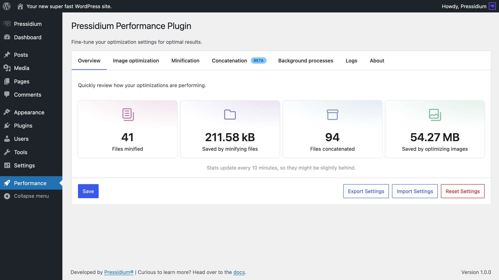
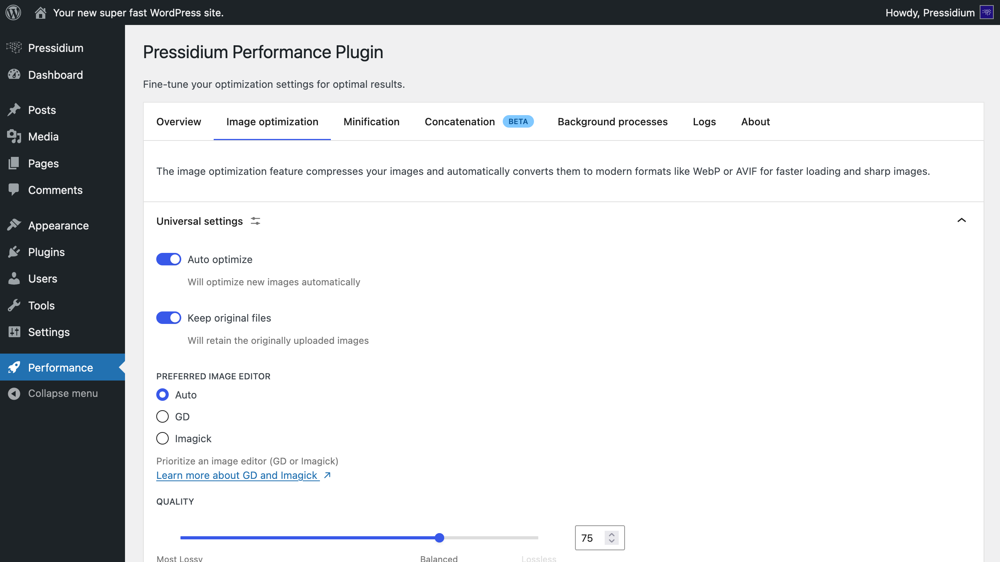
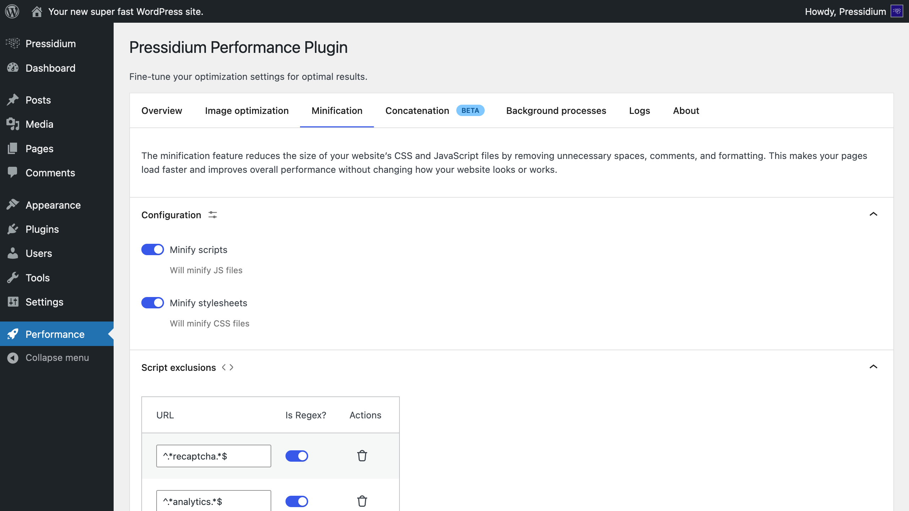
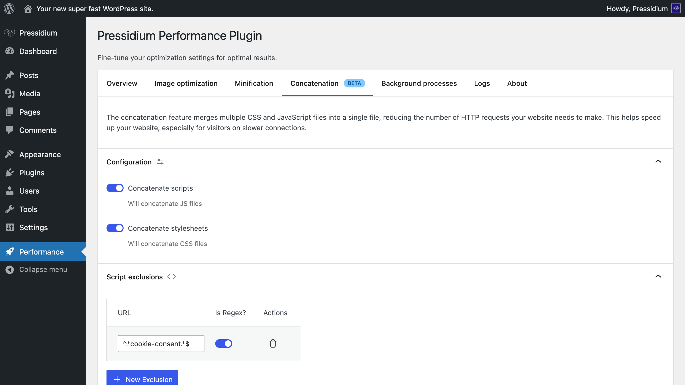
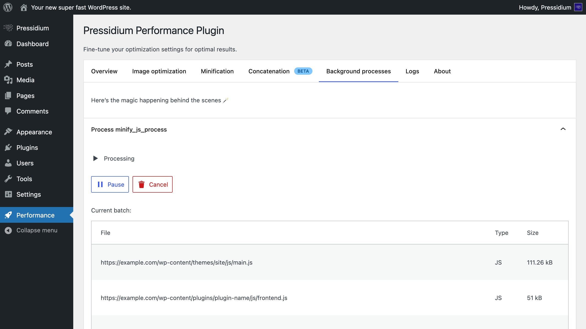

<p align="center">
    
</p>

# Pressidium Performance

🚀 The Pressidium Performance plugin is designed to supercharge your site’s speed and enhance your visitors’ experience by reducing load times and improving your site’s performance scores. It optimizes JavaScript and CSS by minifying and merging files, and compresses images in your Media Library using modern formats like WebP and AVIF to accelerate media loading without sacrificing quality.



## Table of Contents

* [Setup](#setup)
* [Features](#features)
* [Contributing](#contributing)
* [License](#license)
* [About Pressidium](#about-pressidium)

## Setup

1. Install Composer dependencies

    ```bash
    composer install
    ```

2. Install npm dependencies

    ```bash
    npm install
    ```

3. Build the plugin

    ```bash
    npm run build
    ```

4. Upload the entire `pressidium-performance` folder to the `wp-content/plugins/` directory

5. Activate the plugin through the “Plugins” menu in WordPress

## Features

### 🪄 Optimize Your Images



Speed up your site by compressing Media Library images in the background.

* Convert them to modern formats like **WebP or AVIF**
* Automatically **optimize on upload** or **bulk-optimize your entire library**
* **Control quality** by choosing between smaller file sizes or sharper images
* Optionally **keep original files** for peace of mind (automatically restored if you remove the plugin)

### ✂️ Minify Your Scripts and Stylesheets



Improve your site’s performance by **reducing the size of your JavaScript and CSS files**, ensuring faster load times.

### 🗃️ Concatenate JavaScript and CSS Files



Reduce HTTP requests and speed up loading across your entire site, by **combining multiple JavaScript and CSS files into a single bundle**.

### 🕒 Lightweight Smart Background Operations



* **All processes run seamlessly in the background** to minimize site impact, conserve server resources and prevent performance bottlenecks or timeouts.
* **Monitor** every optimization task running behind the scenes. **Pause, resume or cancel tasks** instantly.

## Contributing

Interested in contributing? Thank you! ❤️

Open source projects like this one thrive on the contributions of developers like you. Your help is much appreciated! All types of contributions are welcome and valued. You’ll find everything you need in [`CONTRIBUTING.md`](./CONTRIBUTING.md).

## License

GNU GPL v2 or later, check the [`LICENSE`](./LICENSE) file.

## About Pressidium

<p align="center">
    <a href="https://pressidium.com/free-trial/?utm_source=ppplugin&utm_medium=ghreadme&utm_campaign=wpplugins">
        
    </a>
</p>

This is a free and open source WordPress plugin developed by Pressidium®. Pressidium offers managed hosting for WordPress optimized for performance, security, and scalability, powered by Pressidium EDGE, a globally distributed platform engineered for nonstop performance, fault tolerance, and mission-critical reliability.
